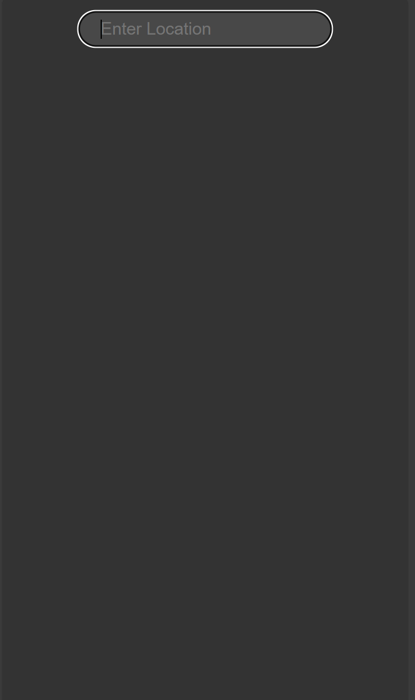
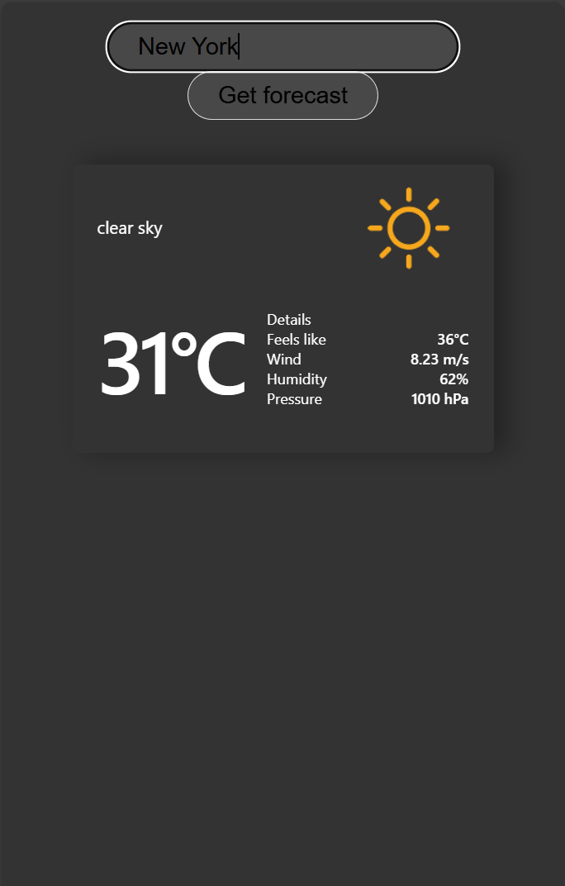
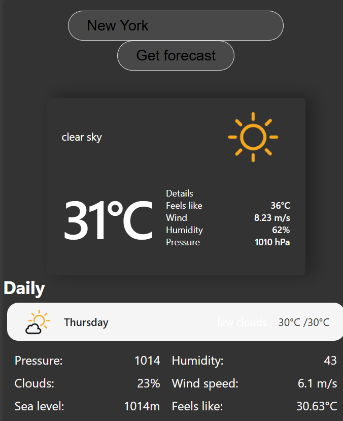

# basic weather app






requirements: nodejs (22.1.0 was used)

## how to run

please visit https://api.openweathermap.org to grab an api key
then rename .env.sample to .env and past your api key there

```
npm i
npm start
```


[try it](https://darkpowerxo.github.io/NextWeather)
